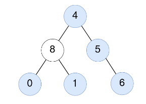

practicing coding with leetcode-examples

Count Nodes Equal to Average of Subtree

Given the root of a binary tree, return the number of nodes where 
the value of the node is equal to the average of the values in its subtree.

Note:

The average of n elements is the sum of the n elements divided by n and 
rounded down to the nearest integer.
A subtree of root is a tree consisting of root and all of its descendants.
 

Example 1:

Input: root = [4,8,5,0,1,null,6]
Output: 5
Explanation: 
For the node with value 4: The average of its subtree is (4 + 8 + 5 + 0 + 1 + 6) / 6 = 24 / 6 = 4.
For the node with value 5: The average of its subtree is (5 + 6) / 2 = 11 / 2 = 5.
For the node with value 0: The average of its subtree is 0 / 1 = 0.
For the node with value 1: The average of its subtree is 1 / 1 = 1.
For the node with value 6: The average of its subtree is 6 / 1 = 6.

Example 2

